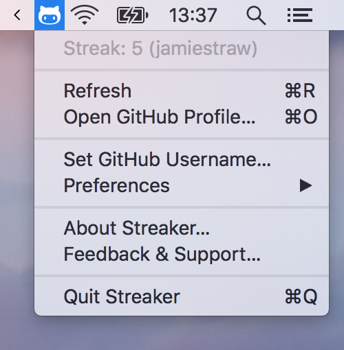
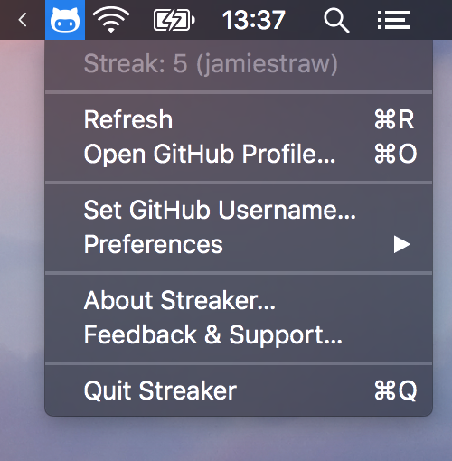

    
    <h3 align="center">Streaker</h3>
    
🐙 GitHub contribution streak tracking menubar app

    
   

## Installation

Download the latest version of Streaker from the the **[GitHub releases](https://github.com/jamieweavis/streaker/releases)** page. (currently macOS only)

## Screenshots

## Menu Bar Icons

Streaker's menu bar icon is updated depending on it's current state:

| | Status | Description |
| ------ | ---- | ----------- |
|  | Done | You've contributed today, nice work. |
|  | Todo | You haven't contributed today, don't forget! |
|  | Loading | Your contribution data is being loaded from GitHub. |
|  | Failed | Your contribution data request failed. |

## License

This project is licensed under the MIT License - see the [LICENSE.md](LICENSE.md) file for details.
