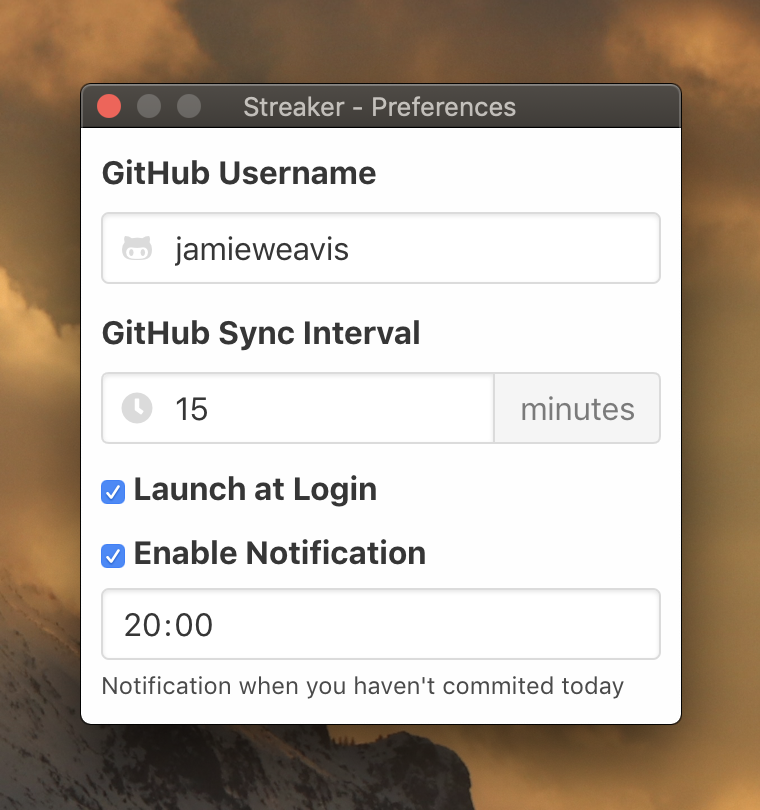

  

<h1 align="center">Streaker</h1>

🔥 GitHub contribution streak & stat tracking menu bar app

  
  
  
  

## Contents

- [Contents](#contents)
- [Installation](#installation)
- [Features](#features)
- [Screenshots](#screenshots)
- [Menu Bar Icons](#menu-bar-icons)
- [Related](#related)
- [License](#license)

## Installation

Download the latest version of Streaker from the **[GitHub releases](https://github.com/jamieweavis/streaker/releases)** page. (currently macOS & Windows only)

## Features

- Current streak, best streak, current contributions, best contributions & total contributions stats
- Launch at login
- Notification when you haven't contributed today

## Screenshots

| Menu Bar                                                                     | Preferences                                                                        |
| ---------------------------------------------------------------------------- | ---------------------------------------------------------------------------------- |
|  |  |

## Menu Bar Icons

Streaker's menu bar icon changes depending on your current daily contribution status:

|                                    | Status  | Description                                           |
| ---------------------------------- | ------- | ----------------------------------------------------- |
|     | Done    | You've contributed today                              |
|     | Todo    | You haven't contributed today                         |
|  | Loading | Your contribution data is being requested from GitHub |
|     | Failed  | Your contribution data request failed                 |

## Related

- [streaker-cli](https://github.com/jamieweavis/streaker-cli) - 🔥 GitHub contribution streak & stat tracking CLI app
- [contribution](https://github.com/jamieweavis/contribution) - 🗓 GitHub contribution streak & stat fetcher with zero dependencies

## License

This project is licensed under the MIT License - see the [LICENSE.md](LICENSE.md) file for details.
