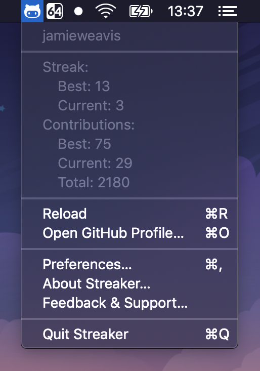

<h3 align="center">Streaker</h3>

🐙 GitHub contribution streak tracking menubar app

    
    
    
    

## Installation

Download the latest version of Streaker from the **[GitHub releases](https://github.com/jamieweavis/streaker/releases)** page. (currently macOS & Windows only)

## Features

- Current streak, best streak, total contribution & best day stats
- Launch at login
- Notification when you haven't contributed today

## Screenshots

### Menu Bar

### Preferences Window

## Menu Bar Icons

Streaker's menu bar icon is updated depending on your current contribution status:

|                                                              | Status  | Description                                           |
| ------------------------------------------------------------ | ------- | ----------------------------------------------------- |
|  | Done    | You've contributed today                              |
|  | Todo    | You haven't contributed today                         |
|  | Loading | Your contribution data is being requested from GitHub |
|  | Failed  | Your contribution data request failed                 |

## Related

- [streaker-cli](https://github.com/jamieweavis/streaker-cli) - 🐙 GitHub contribution streak fetching CLI app
- [contribution](https://github.com/jamieweavis/contribution) - 🗓 GitHub contribution count & streak fetcher with zero dependencies

## License

This project is licensed under the MIT License - see the [LICENSE.md](LICENSE.md) file for details.
