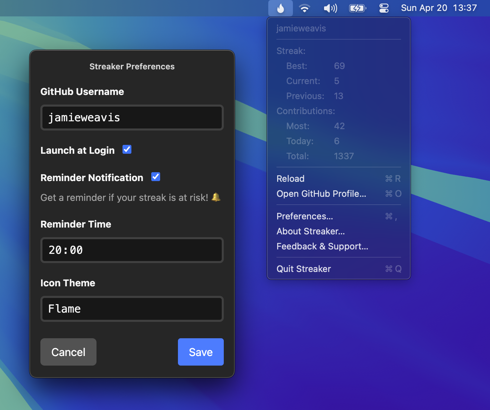
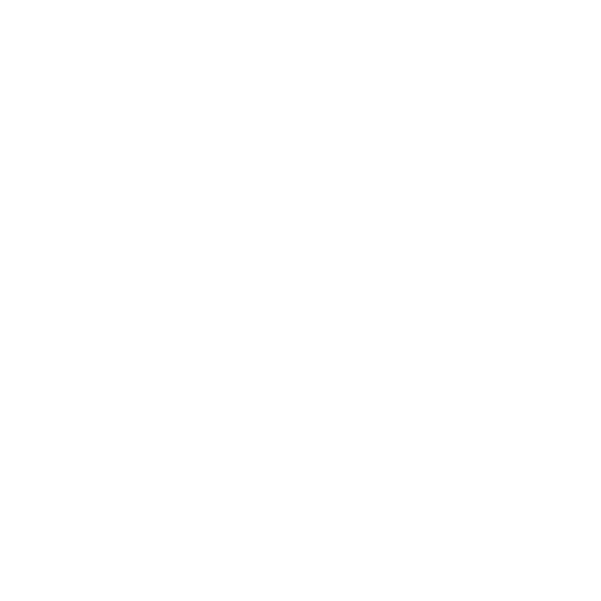
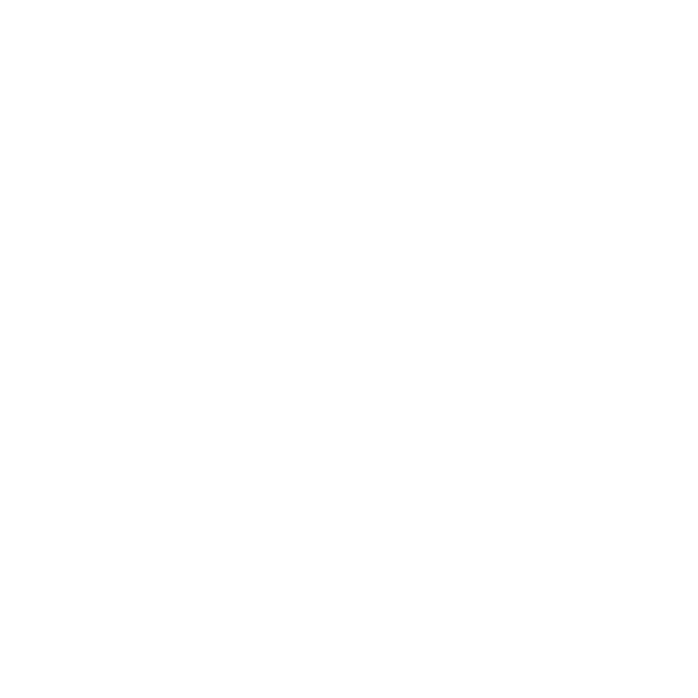
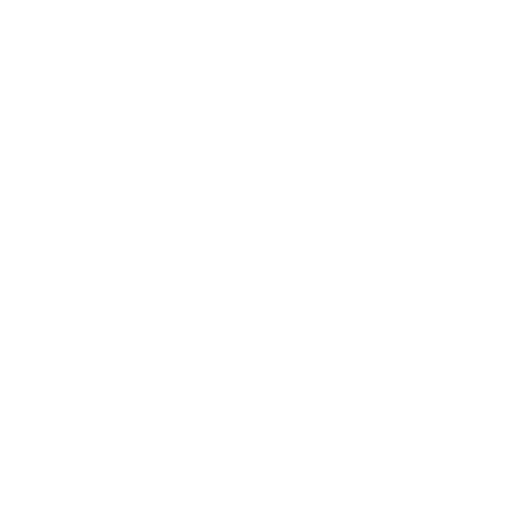
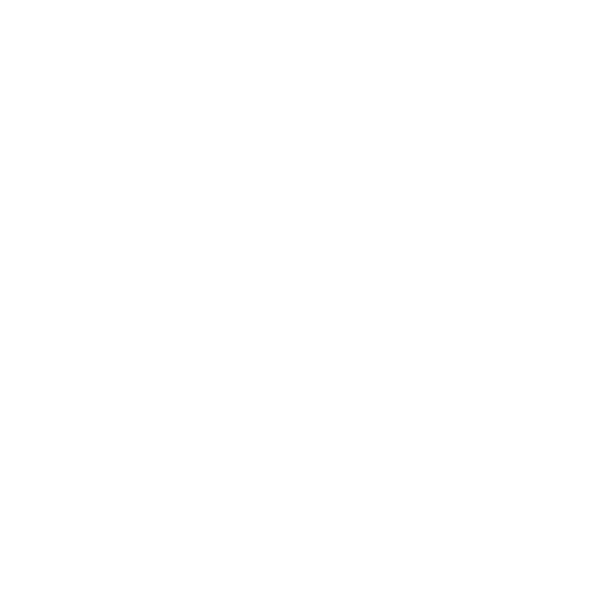
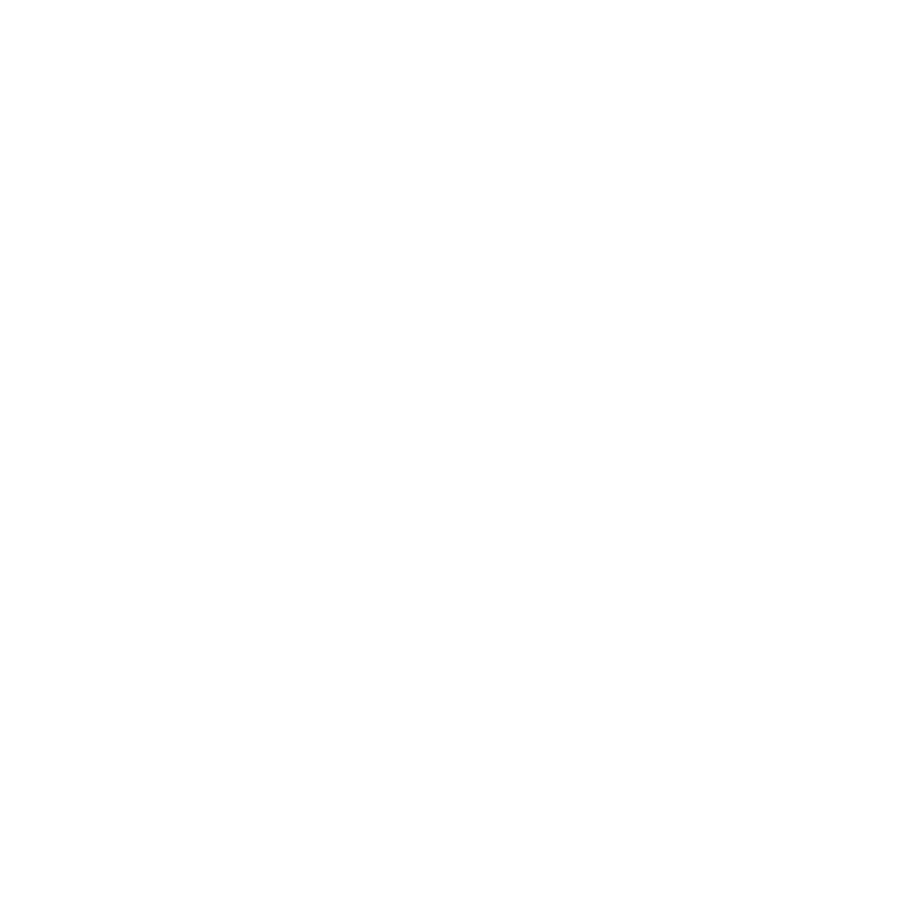
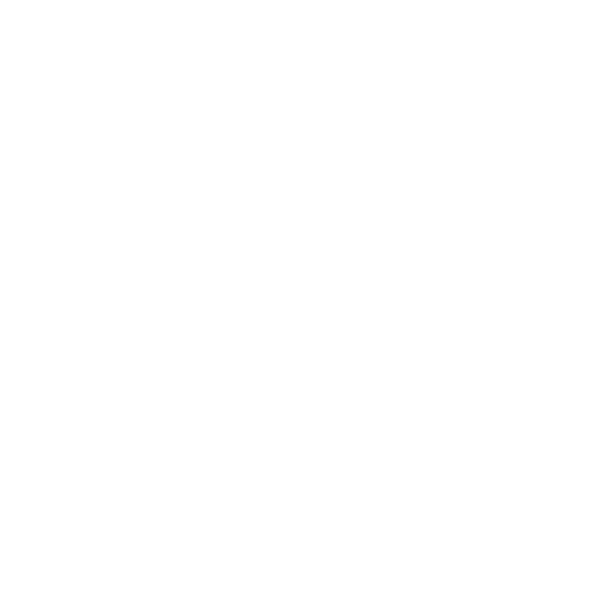

# Streaker 

> 🔥 GitHub contribution streak & stat tracking menu bar app</p>

[](https://github.com/jamieweavis/streaker/actions)
[](https://github.com/jamieweavis/streaker/releases)
[](https://github.com/jamieweavis/streaker/releases)
[](https://github.com/jamieweavis/streaker/blob/main/LICENSE)



## Install

Download the latest version of Streaker from the **[GitHub releases](https://github.com/jamieweavis/streaker/releases)** page. Or see the **[Building Locally](#building-locally)** section to build it yourself.

## Features

- Menu bar contribution stats
  - Streak
    - Best
    - Current
    - Previous
  - Contributions
    - Most (day)
    - Today
    - Total (year)
- Menu bar icon changes depending on contribution status
  - Empty - you haven't contributed today
  - Filled - you have contributed today
  - Crown - you're currently on your best streak
- Three different menu bar icon themes
  - Flame
  - Tile
  - Octocat
- Reminder notification so you don't lose your streak

### Menu Bar Icons

#### Light Mode

| State       | Flame                                                                                  | Tile                                                                                 | Octocat                                                                                    |
| ----------- | -------------------------------------------------------------------------------------- | ------------------------------------------------------------------------------------ | ------------------------------------------------------------------------------------------ |
| Pending     |            |            |            |
| Contributed |  |  |  |
| Streaking   |          |      |      |

#### Dark Mode

| State       | Flame                                                                                        | Tile                                                                                       | Octocat                                                                                          |
| ----------- | -------------------------------------------------------------------------------------------- | ------------------------------------------------------------------------------------------ | ------------------------------------------------------------------------------------------------ |
| Pending     |            |            |            |
| Contributed |  |  |  |
| Streaking   |          |      |      |

## Building Locally

The app is built & deployed for all platforms via GitHub Actions automatically, but you can build it locally for your platform with the following steps:

Clone the repository
```bash
git clone https://github.com/jamieweavis/streaker.git

cd streaker
```

Install npm dependencies (recommended to use Node.js v22)
```bash
npm install
```

Package the app for your current platform
```bash
npm run package
```

The packaged app will now be in the `out/` directory

## Development

Run the app in development mode
```bash
npm run start
```

*Only the renderer process currently supports hot reloading, changes in `src/main/` will require a restart*

## Built with

- [TypeScript](https://github.com/microsoft/TypeScript)
- [Electron](https://github.com/electron/electron)
- [Tailwind CSS](https://github.com/tailwindlabs/tailwindcss)
- [Electron Forge](https://github.com/electron/forge)

## Related

- [Streaker CLI](https://github.com/jamieweavis/streaker-cli) - 🔥 GitHub contribution streak & stat tracking command line app
- [Contribution](https://github.com/jamieweavis/contribution) - 🗓 GitHub user contribution graph parser, streak & stat calculator

## License

This project is licensed under the MIT License - see the [LICENSE](LICENSE) file for details.
