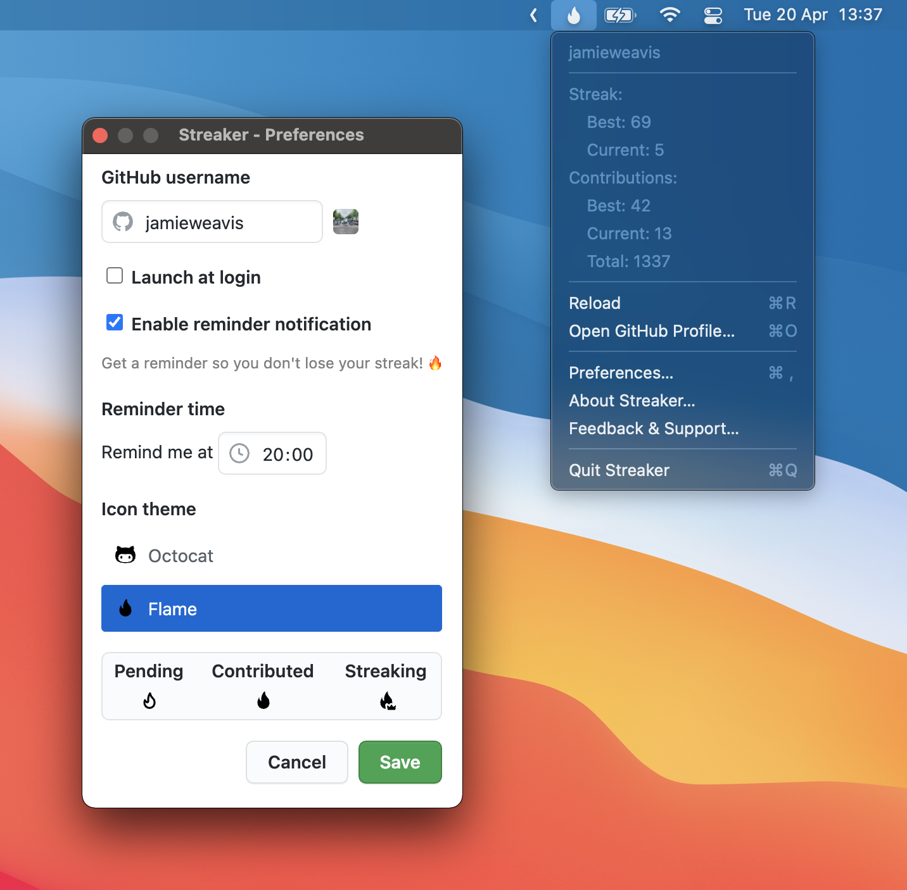

  

<h1 align="center">Streaker</h1>

🔥 GitHub contribution streak & stat tracking menu bar app

  
  
  
  

## Installation

### Manual

Download the latest version of Streaker from the **[GitHub releases](https://github.com/jamieweavis/streaker/releases)** page. (currently macOS & Windows only, track work for Linux support in [#2](https://github.com/jamieweavis/streaker/issues/2))

### Homebrew Cask

Coming soon, track progress in [#138](https://github.com/jamieweavis/streaker/issues/138)

## Features

- Contribution stats from the menu bar 📈
  - Best streak
  - Current streak
  - Best contributions (in a single day)
  - Current contributions (today)
  - Total contributions (this year)
- Menu bar icon changes depending on contribution status
  - Empty - You haven't contributed today, your streak is in danger 😱
  - Filled - You have contributed today, your streak is secure 😊
  - Crown - You're on your best streak! 🤩
- Two different menu bar icon themes
  - Flame 🔥
  - Octocat 🐙
- Reminder notification so you don't lose your streak ⏰

## Screenshot

## Built with

- [TypeScript](https://github.com/microsoft/TypeScript)
- [Electron](https://github.com/electron/electron)
- [React](https://github.com/facebook/react)

## Related

- [streaker-cli](https://github.com/jamieweavis/streaker-cli) - 🔥 GitHub contribution streak & stat tracking CLI app
- [contribution](https://github.com/jamieweavis/contribution) - 🗓 GitHub contribution streak & stat fetcher with zero dependencies
